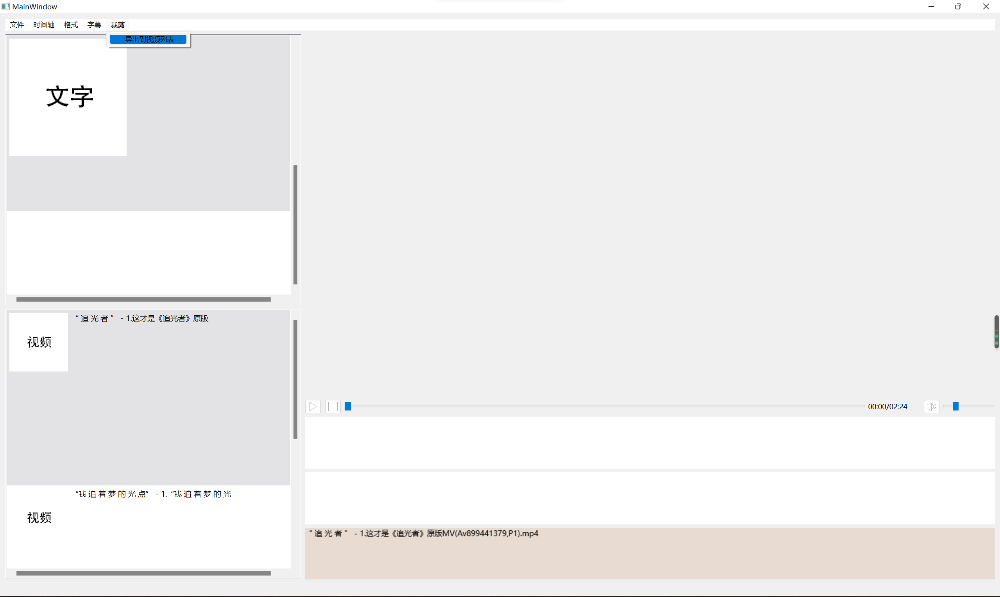
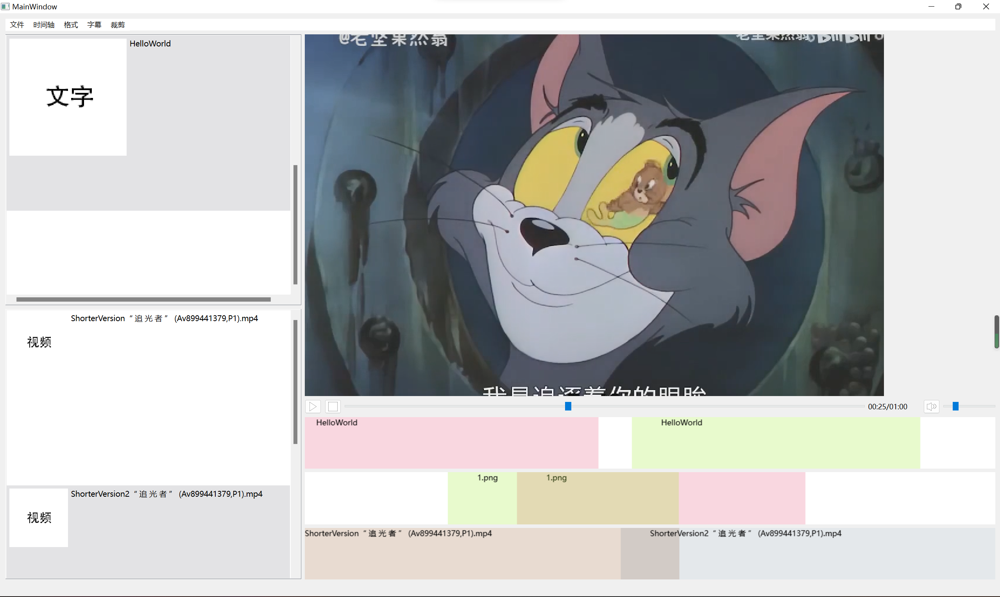

# 1. 模块间逻辑关系


主窗口类作为前后端的沟通平台，通过connect等方法，转发交互请求及结果。

前端的时间轴和素材库、视频列表根据后端维护的DataModel进行视图渲染；视频预览根据时间轴信息重新渲染视频帧。

VideoProcessionInterface集中存储了DataModel，同时还转发一些交互请求给Ffmpeg封装接口，再进一步调用ffmpeg命令行工具。

# 2. 程序运行的主要流程
1. 导入视频、图片、文字等素材
2. 将视频逐个加入时间轴，加入后，程序后台会生成当前时间轴对应的导出视频以便于预览
3. 将素材加入时间轴，并配置素材信息
4. 导出融合素材的最终视频

# 3. 完成的要求

## 3.1 界面

### 3.1.1 菜单、工具栏

所有功能均在抬头的菜单工具栏给出点击接口。

### 3.1.2 视频列表

视频列表中列出导入的视频。

### 3.1.3 素材库

素材库中列出导入的图片、文字。

### 3.1.4 时间轴

右下角为时间轴，显示了视频、素材的名字和时间范围，多个素材可叠加显示并显示重叠部分。

### 3.1.5 预览窗口

右上角为预览窗口。双击选择视频列表中的视频即可进行预览；或点击“时间轴”->“预览”即可预览时间轴视频。

## 3.2 功能

### 3.2.1 视频导入

点击后打开QFileDialog窗口选择导入的视频。

### 3.2.2 素材库导入


点击后打开QFileDialog窗口选择导入的图片。


点击后打开QLineEdit输入窗口，输入文字即可。


### 3.2.3 素材库删除

必须先选中，再点击删除。类似地，也可删除视频列表中的视频

### 3.2.4 加入视频到时间轴

先选中待添加到时间轴的视频，再点击添加视频。

屏幕中会出现加载信息的窗口，便于了解加载进度

### 3.2.5 视频裁剪

点击“裁剪”->“导出到视频列表”，选择裁剪出的视频的放置位置（考虑到有时候仅需要简单的裁剪）后即可。**保存文件名需添加后缀名，理论上可转换为多数视频格式（基于Ffmpeg）。**


填入起始时间和结束时间，窗口会简略检测填入数字是否符合相关规则（如起始时间<=结束时间，结束时间<=视频总时长）

稍等一段时间的Ffmpeg处理，即可得到已加入视频列表的剪辑视频

### 3.2.6 视频切分
类似于视频裁剪的方法，用户手动操作，根据目标切分点，进行视频裁剪即可得到结果。

### 3.2.7 视频合并

将需要合并的视频加入时间轴，点击“文件”->“导出视频”即可合并视频。

### 3.2.8 视频素材添加到时间轴

选中待添加的图片或文字，点击“时间轴”->“添加图片/文字”。


填入坐标、出现时间和特效信息。**需要注意的是，图片类型必须具有淡入淡出效果。（受Ffmpeg限制，必须控制alpha通道值以避免图片消失后在视频画面中留下黑色图块）**


加入成功。

### 3.2.9 视频特效添加
可实现淡入淡出效果（为避免留下黑色图块，图片强制使用淡入淡出）、平移效果；在添加时可配置有关信息。


### 3.2.10 剪辑预览

滑块可调节播放位置；点击“时间轴”->“预览”即可预览剪辑后的视频。

### 3.2.11 剪辑视频预览指针

如图所示即为视频时间点指针。

### 3.2.12 加入字幕到时间轴

点击后加载QFileDialog选择对应的字幕文件


加载字幕中……
测试字幕文件内容如下：
```ass
[Script Info]
; Script generated by FFmpeg/LavcLIBAVCODEC_VERSION
ScriptType: v4.00+
PlayResX: 384
PlayResY: 288
ScaledBorderAndShadow: yes

[V4+ Styles]
Format: Name, Fontname, Fontsize, PrimaryColour, SecondaryColour, OutlineColour, BackColour, Bold, Italic, Underline, StrikeOut, ScaleX, ScaleY, Spacing, Angle, BorderStyle, Outline, Shadow, Alignment, MarginL, MarginR, MarginV, Encoding
Style: Default,Cascadia Mono ExtraLight,16,&Hffffff,&Hffffff,&H0,&H0,0,0,0,0,100,100,0,0,1,1,0,2,10,10,10,0

[Events]
Format: Layer, Start, End, Style, Name, MarginL, MarginR, MarginV, Effect, Text
Dialogue: 0,0:00:01.80,0:00:06.73,Default,,0,0,0,,{\c&H0&}Test1{\c}
Dialogue: 0,0:00:24.40,0:00:28.22,Default,,0,0,0,,{\c&H0&}Test2{\c}

```
以下为添加字幕的软件内预览结果：


### 3.2.13 内嵌字幕
导出视频中的字幕可正常显示如下：


### 3.2.14 导出
预配置如下：


“文件”->“导出视频”，选择导出位置并通过命名控制格式（基于Ffmpeg，理论上可支持多数主流视频格式）：


可选择需要的分辨率及码率：

点击确认后，开始导出：

特效可正常加载，具体视频已保存在Doc文件夹的DemoVideo文件夹中。

# 4. 参考文献
1. Qt6 Doc https://doc.qt.io/qt-6/
2. Ffmpeg Doc http://www.ffmpeg.org/documentation.html
3. 素材库视图的实现参考了Github Repository https://github.com/FlyWM/MuListView

